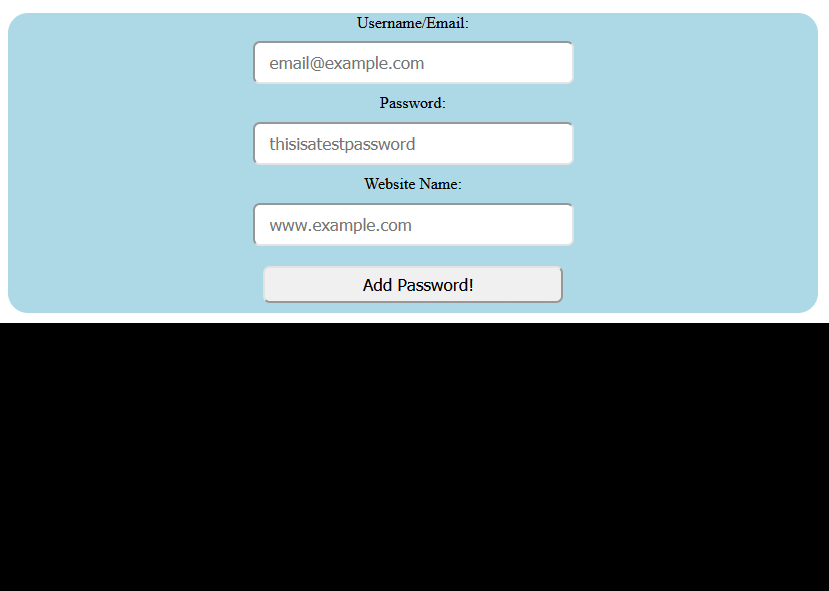

# Password_Manager

This is a simple browser based Password Manager.
Made using React, MySQL, NodeJS.

## User Interface

* **UI walk-through**

Users can add their username/email, password and website name for which they want to save password.

Later when they click on the website name, it reveals their passwords.

Passwords are encrypted using **AES-256-CTR** algorithm and stored in MySQL databse.

\
This project was bootstrapped with [Create React App](https://github.com/facebook/create-react-app).

## Available Scripts

In the each project directory (client and server), run:

### `yarn start`

Runs the app in the development mode.\
Open [http://localhost:3000](http://localhost:3000) to view it in the browser.

The page will reload if you make edits.\
You will also see any lint errors in the console.
